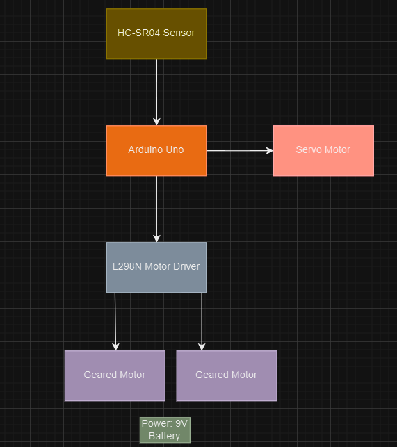
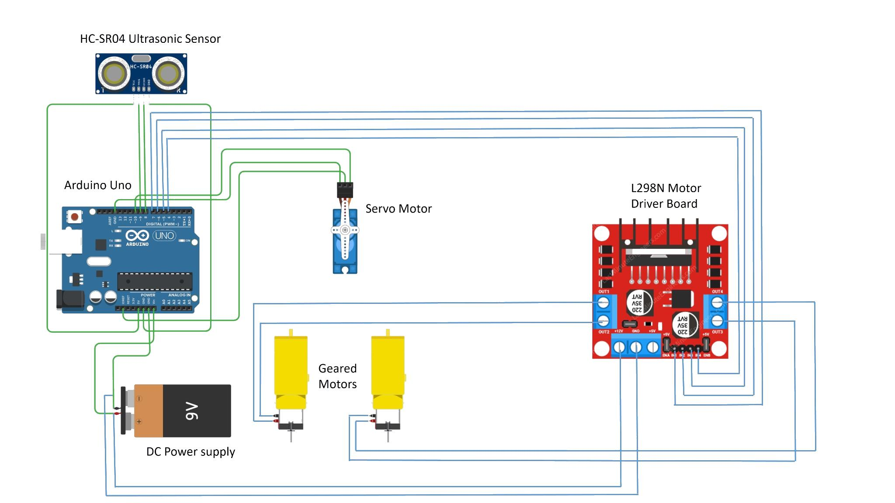
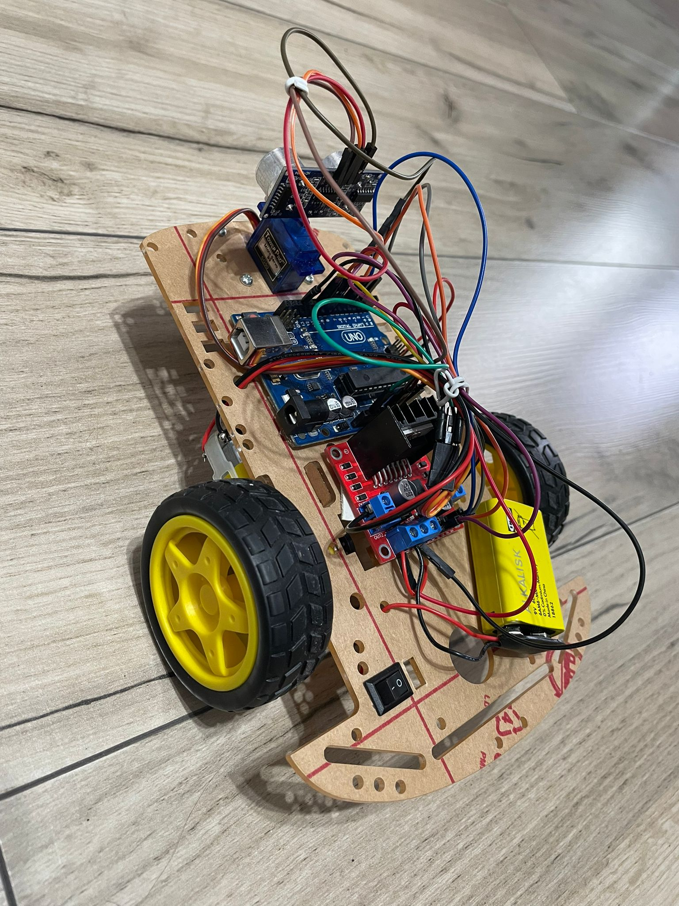
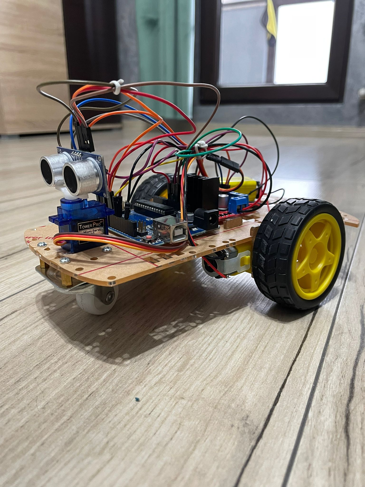

# Obstacle-Avoiding-Robot

# Table of contents
- [Introduction](#introduction)
- [General Description](#general-description)
- [Block Diagram](#block-diagram)
- [Hardware Functionality](#hardware-functionality)
- [Hardware Design](#hardware-design)
  - [BOM](#bom)
  - [Circuit](#circuit)
  - [Connected Components](#connected-components)
- [Software Design](#software-design)
  - [Planned Functionalities](#planned-functionalities)
  - [Functional Breakdown](#functional-breakdown)

## Introduction
- **What does it do?**
  - The robot detects obstacles in its path and dynamically adjusts its direction to avoid collisions.

- **What is its purpose?**
  - The goal of this project is to create a simple, autonomous robot while gaining hands-on experience with robotics, electronics, and programming.
    
- **What inspired the idea?**
  - The idea came from the desire to create an efective robot car that simulates the movement principle of a robotic vacuum cleaner, navigating and avoiding obstacles while covering the area.

- **Why is it useful?**
  - This project serves as an excellent introduction to robotics concepts, such as sensor integration and motor control. It is easy to extend for more complex tasks like line following, mapping, or obstacle classification.

## General Description

   The obstacle-avoiding robot is designed to move autonomously in an environment filled with obstacles. It uses an HC-SR04 ultrasonic sensor to measure distances and determine when to avoid obstacles by turning left, right, or stopping.
The robot is powered by a motor driver module (L298N) that controls two DC motors connected to wheels, allowing movement.

A servo motor (SG90) is used to rotate the ultrasonic sensor, enabling the robot to scan its surroundings for obstacles in multiple directions. The entire system is controlled by an Arduino UNO, which processes data from the sensor and executes appropriate movement commands.

## Block Diagram

## Hardware Functionality

**1. Arduino Uno**
- The microcontroller acts as the brain of the project, controlling all other components based on sensor inputs and programmed logic.
- It receives data from the HC-SR04 Ultrasonic Sensor and processes it to decide motor movements using the L298N Motor Driver Board.

**2. HC-SR04 Ultrasonic Sensor**
- **Purpose:** Measures the distance to an obstacle using ultrasonic waves.
- **Pins Used:**
  - VCC: Connected to 5V pin of Arduino (Power supply).
  - GND: Connected to the GND of Arduino (Ground reference).
  - TRIG (Trigger Pin): Connected to Arduino Pin 9. It sends out a pulse to start distance measurement.
  - ECHO (Echo Pin): Connected to Arduino Pin 8. It receives the reflected ultrasonic pulse to calculate distance.
    
**3. Servo Motor**
- **Purpose:** Rotates the ultrasonic sensor (left and right) to scan for obstacles in different directions.
- **Pins Used:**
  - Signal Pin: Connected to Arduino Pin 10. It sends PWM (Pulse Width Modulation) signals to control the servo’s angle.
  - VCC and GND: Connected to a 5V power supply and ground.

**4. L298N Motor Driver Board**
- **Purpose:** Controls the two geared motors based on commands from the Arduino. It allows the robot to move forward, backward, left, and right.
- **Pins Used:**
  - IN1 and IN2: Connected to Arduino Pins 4 and 5. Control the direction of Motor 1.
  - IN3 and IN4: Connected to Arduino Pins 6 and 7. Control the direction of Motor 2.
  - OUT1 and OUT2: Connected to Motor 1 terminals.
  - OUT3 and OUT4: Connected to Motor 2 terminals.
  - ENA and ENB: Connected to the 5V PWM pins for motor speed control.
  - VCC (12V Input): Connected to the 9V DC Power Supply. Powers the motors.
  - GND: Common ground for the power supply, motors, and Arduino.

**5. Geared Motors (2x)**
- Controlled via the L298N Motor Driver for directional and speed control.
- Connected to the motor outputs (OUT1, OUT2, OUT3, and OUT4).

**6. 9V DC Power Supply**
- Powers the motors and the L298N motor driver. The Arduino can be powered either through its USB port or a separate power source.

## Hardware Design
 ### BOM 

| **Component**               | **Description**                                      | **Quantity** | **Datasheet / Link**                                                                 |
|-----------------------------|------------------------------------------------------|--------------|-----------------------------------------------------------------------------------|
| **Arduino Uno**             | Microcontroller board for controlling the components | 1            | [Arduino Uno Datasheet](https://www.alldatasheet.com/datasheet-pdf/view/241077/ATMEL/ATMEGA328P.html)       |
| **HC-SR04 Ultrasonic Sensor** | Distance measurement using ultrasonic waves          | 1            | [HC-SR04 Datasheet](https://www.alldatasheet.com/datasheet-pdf/pdf/1132204/ETC2/HCSR04.html) |
| **Servo Motor (SG90)**      | Small servo motor for rotating the ultrasonic sensor | 1            | [SG90 Servo Datasheet](https://www.alldatasheet.com/datasheet-pdf/pdf/1572383/ETC/SG90.html) |
| **L298N Motor Driver Module** | Dual H-Bridge motor driver for controlling motors    | 1            | [L298N Datasheet](https://www.alldatasheet.com/datasheet-pdf/pdf/22440/STMICROELECTRONICS/L298N.html)              |
| **Geared DC Motors**        | Motors for driving the robot wheels                  | 2            | - |
| **Wheels (Compatible)**     | Wheels compatible with geared motors                 | 2            | -                                                                                 |
| **9V Battery + Battery Clip** | Power supply for motors and L298N driver             | 1            | -                                                                                 |
| **Jumper Wires (Male-Male)** | Wires for connecting components                      | 10-15        | -                                                                                 |
| **Jumper Wires (Male-Female)** | Wires for connecting sensor and servo motor          | 4-6          | -                                                                                 |

 ### Circuit

 ### Connected Components

## Software Design

### IDE: Visual Studio Code, PlatformIO  
### Libraries: Arduino, Servo  

### Planned Functionalities:
- **Real-Time Obstacle Detection**: Continuously monitor the environment using an ultrasonic sensor to detect obstacles within a specified range.
- **Accurate Distance Calculation**: Measure and display the precise distance to nearby objects, updating in real-time.
- **Obstacle Avoidance**:
  - **Forward Movement**: The robot moves forward when no obstacles are detected within the safe distance.
  - **Obstacle Detection**: When an obstacle is detected, the robot pauses, evaluates the surroundings, and avoids the obstacle by turning and moving backward slightly.
  - **Decision Making**: The robot determines the direction to avoid obstacles based on sensor readings (left vs right) and adjusts accordingly.
- **Servo-Based Scanning**: The servo motor scans the left and right directions to evaluate obstacles and determine the best path for avoidance.
- **Motor Control**: The motors are controlled to enable forward, backward, and turning movements based on obstacle detection.

### Functional Breakdown:

#### 1. **Distance Measurement (Ultrasonic Sensor)**:
   - The `getDistance()` function sends a pulse via the trigPin, calculates the duration it takes for the echo to return, and converts it into a distance in centimeters.
   - A timeout of 30ms is set for the echo response to ensure valid readings. If no echo is received within the specified time, the function returns a `-1` value.

#### 2. **Distance Stabilization**:
   - To reduce the effect of noise in measurements, the `stabilizeDistance()` function averages multiple readings (5 samples) and updates the distance value with the average of valid samples.

#### 3. **Movement Control**:
   - **`moveForward()`**: The robot moves forward by setting the appropriate pins for the motors.
   - **`stopMotors()`**: Stops all motors by setting motor control pins to LOW.
   - **`moveBackward()`**: Moves the robot backward for slight distance adjustment before turning.
   - **`turnLeft()`** and **`turnRight()`**: Control the robot to turn left or right, depending on the obstacle's position.

#### 4. **Obstacle Avoidance**:
   - If an obstacle is detected within the safe distance, the robot stops and scans left and right using the servo. It measures the distance in both directions and turns toward the side with more space.
   - The robot moves backward slightly before turning to ensure proper clearance.

#### 5. **Servo Scanning**:
   - The servo scans the environment in 180 degrees (0 to 180 degrees) to check the left and right distances. After scanning, it returns to the center position (90 degrees).

#### 6. **Decision Making**:
   - The robot uses the scanned left and right distances to determine which direction to turn. It prioritizes the side with the most open space to avoid collisions.

## Conclusion
**TBD**
## Results
**TBD**
## References/Resources
**TBD**

## License

